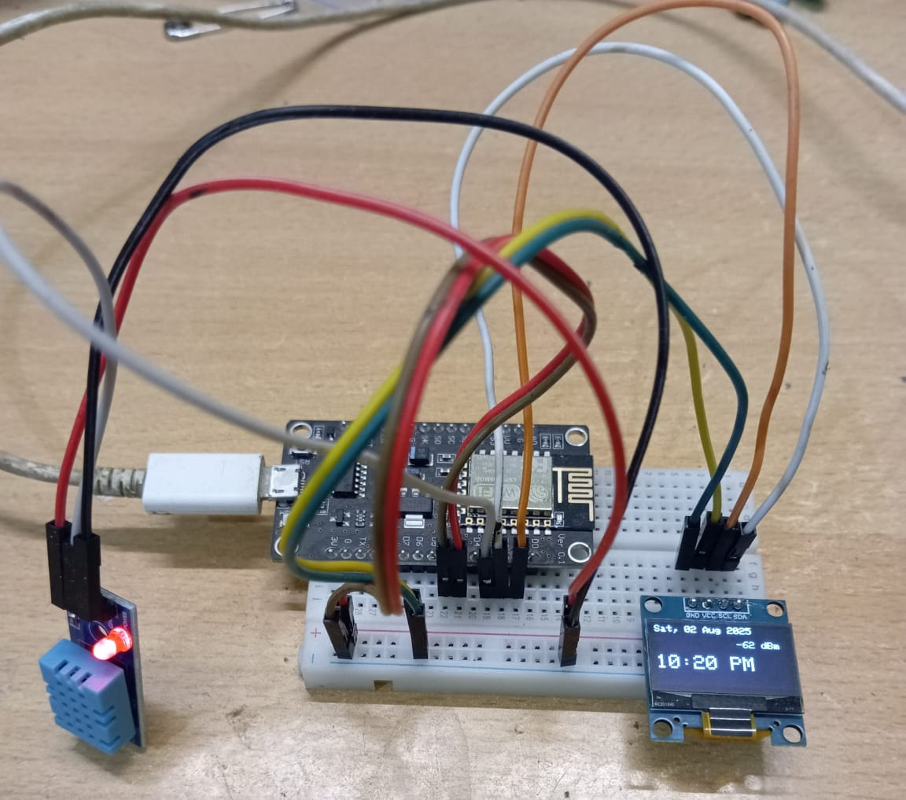
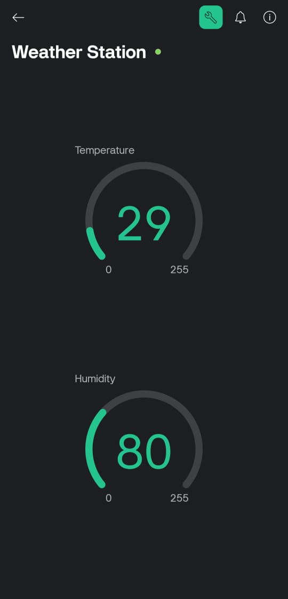

# Weather_Station
# 🌦️ IoT Weather Station using ESP8266 + Blynk

This is my **first IoT project**, where I’ve built a weather station using an **ESP8266 NodeMCU**, **DHT11 sensor**, **OLED display**, and integrated it with the **Blynk app**.

The station displays:
- 🕒 **Real-time time and date** (via NTP)
- 🌡️ **Room temperature and humidity** (via DHT11)
- 🌤️ **Current weather & 3-day forecast** (via OpenWeatherMap API)
- 📶 **Wi-Fi signal strength** (in dBm)
- 📲 **Remote monitoring via Blynk App**

---

## 🧰 Tech Stack

| Hardware | Purpose |
|----------|---------|
| ESP8266 (NodeMCU) | Microcontroller with WiFi |
| DHT11 | Temperature & Humidity Sensor |
| OLED 128x64 (I2C) | Display all data |
| Internet | To fetch time and weather |
| Blynk App | Remote monitoring on mobile |

| Software | Purpose |
|----------|---------|
| Arduino IDE | Code development & upload |
| Blynk Platform | App-based monitoring |
| OpenWeatherMap | Weather API data |
| NTPClient | Time syncing via NTP |
| ArduinoJson | Parse API data |
| Adafruit_GFX & SSD1306 | OLED screen control |

---

## 🖼️ Screens Displayed on OLED

1. **Date and Time** (12-hour format with AM/PM)
2. **Room Conditions**
   - Temperature in °C
   - Humidity in %
3. **Current Weather**
   - Live temperature
   - Weather condition (e.g., Clear, Rain, Clouds)
4. **3-Day Forecast** (Fetched every cycle)
5. **Wi-Fi RSSI (dBm)** to show signal strength

---

## 📱 Blynk App Setup

1. Create a new template in the **Blynk app**
2. Add 2 **Value Display** widgets:
   - `V0` → Temperature
   - `V1` → Humidity
3. Use the `BLYNK_TEMPLATE_ID`, `BLYNK_TEMPLATE_NAME`, and `BLYNK_AUTH_TOKEN` from your template in the code.

## 🔌 Wiring

| Component | ESP8266 Pin |
|-----------|-------------|
| OLED SDA  | D2 (GPIO4)  |
| OLED SCL  | D1 (GPIO5)  |
| DHT11     | D3 (GPIO0)  |
| VCC/GND   | 3.3V / GND  |

---

## 🚀 Future Improvements
- Add sliding animations for screen transitions
- Use icons for weather (☀️, 🌧️, ☁️)
- Store historical data using Blynk Cloud
- Add touch buttons or voice control

---

## 📦 Folder Structure

Weather_Station/
├── README.md 
├── Weather_Station.ino
└── | Library Name       | Purpose                                        |
| ---------------------- | ---------------------------------------------- |
| **ESP8266WiFi**        | To connect the ESP8266 board to Wi-Fi          |
| **ESP8266HTTPClient**  | To send HTTP GET requests to APIs              |
| **WiFiUdp**            | Required for the NTP time client               |
| **NTPClient**          | To fetch current time and date via NTP         |
| **ArduinoJson**        | To parse JSON data from the OpenWeatherMap API |
| **Adafruit\_GFX**      | Graphics library for OLED display              |
| **Adafruit\_SSD1306**  | OLED driver for 128x64 I2C OLED                |
| **DHT**                | To read temperature and humidity from DHT11    |
| **BlynkSimpleEsp8266** | To connect with the Blynk app using ESP8266    |
├── assets/
   ├── weather_station.jpg
   └── blynk_ui.png

## 📷 Project Preview

---

## 🙌 Author

**Arpit Kumar**  
Made with ❤️ as my first IoT project.
